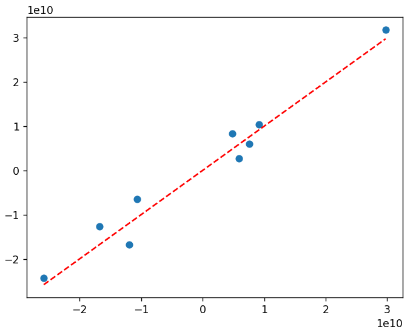

# IndiGo Financials ML Model

Regression models to predict IndiGo's quarterly profit using historical financial and operational data.

## Models

This project implements and compares three regression models:

1. Linear Regression
2. Polynomial Regression
3. Support Vector Regression (SVR)

## Dataset

The dataset contains quarterly IndiGo financial and operational information.

### Features

- `Quarter` - The 3 month time period used to track the financial performance of 6E
- `Operating Revenue` - Revenue earned from day-to-day flying operations of the airline
- `Non-Operating Revenue` - Revenue not earned from operations (Money earned from Sale-Leasback of aircraft etc.)
- `ASK` - Available Seat Kilometers (Total capacity offered)
- `RPK` - Revenue Passenger Kilometers (Total passenger traffic)
- `PLF` - Passenger Load Factor (in %)
- `RASK` - Revenue Per Available Seat Kilometer (How much money an airline generates for every seat flown one kilometer). Higher the better
- `CASK` - Cost Per Available Seat Kilometer (Unit cost or operational efficiency). Lower the better
- `CASK ex-Fuel` - Cost Per Available Seat Kilometer excluding fuel costs
- `Fuel Costs` - Self explanatory
- `Other Costs` - Cost of new aircraft, spares purchased, airport fees etc..  
- `Fleet` - Size of fleet (ATR, A320 family, 737, 777 & 787 have been part of IndiGo's fleet. Most owned/dry-lease, some on wet-lease)
- `USD` - Exchange rate of USD with INR

### Target

- `Profit` - Net money made during the period


<p align="center">Graphs showing how different features influence Profit</p>  

## Preprocessing

`Quarter` is a categorical feature and is one-hot encoded using:

```python
OneHotEncoder(drop="first", handle_unknown="ignore")
```

Numerical features are standardized using:

```python
StandardScaler()
```

Preprocessing is performed with a `ColumnTransformer` and `Pipeline` so that transformations learned from the training data are reused consistently during testing and prediction.

The general workflow is:

```text
Raw Data
   |
   +-- Quarter -----------> OneHotEncoder
   |
   +-- Numeric Features --> StandardScaler
   |
   v
Processed Features
   |
   v
Regression Model
   |
   v
Predicted Profit
```

## 1. Linear Regression

Linear Regression is used as the baseline model.

```python
from sklearn.linear_model import LinearRegression

model = Pipeline([
    ("Preprocessor", preprocessor),
    ("Regressor", LinearRegression())
])

model.fit(X_train, y_train)
y_pred = model.predict(X_test)
```

Linear Regression assumes a linear relationship between the input features and the target.


<p align="center">Graph showing how Linear Regression fits the test set</p>

## 2. Polynomial Regression

Polynomial Regression extends Linear Regression by generating polynomial and interaction features.

The current implementation uses degree 2:

```python
PolynomialFeatures(
    degree=2,
    include_bias=False
)
```

The numerical features are standardized and then expanded into polynomial features.

```python
model = Pipeline([
    ("Preprocessor", preprocessor),
    ("Regressor", LinearRegression())
])
```

Polynomial Regression can model nonlinear relationships, but it can also produce many features and overfit small datasets. Therefore, higher polynomial degrees should be used carefully.

## 3. Support Vector Regression

Support Vector Regression is used as a nonlinear regression model.

A typical implementation is:

```python
from sklearn.svm import SVR

model = Pipeline([
    ("Preprocessor", preprocessor),
    ("Regressor", SVR(
        kernel="rbf",
        C=100,
        epsilon=0.1
    ))
])

model.fit(X_train, y_train)
y_pred = model.predict(X_test)
```

SVR is sensitive to feature scale, so numerical features are standardized before training.

The RBF kernel allows SVR to learn nonlinear relationships without explicitly generating polynomial features.

## Model Evaluation

The models are evaluated using MAE, MSE, RMSE, and R².

### Mean Absolute Error

MAE measures the average absolute difference between actual and predicted values.

```python
mae = np.mean(np.abs(y_test - y_pred))
```

or:

```python
from sklearn.metrics import mean_absolute_error

mae = mean_absolute_error(y_test, y_pred)
```

Lower MAE is better.

### Mean Squared Error

MSE is the average squared prediction error.

```python
mse = np.mean((y_test - y_pred) ** 2)
```

Lower MSE is better.

### Root Mean Squared Error

RMSE is the square root of MSE.

```python
rmse = np.sqrt(mse)
```

Lower RMSE is better.

### R-squared

R² measures how much of the variation in the target is explained by the model.

```python
from sklearn.metrics import r2_score

r2 = r2_score(y_test, y_pred)
```

A value closer to 1 generally indicates better performance.

## Current Results

On the evaluated test split, the current results were:

| Model | R² | MAE | RMSE |
|---|---:|---:|---:|
| Linear Regression | 0.960 | approximately ₹2.91B | approximately ₹3.17B |
| Polynomial Regression | 0.846 | approximately ₹4.22B | approximately ₹6.26B |
| SVR | To be evaluated | To be evaluated | To be evaluated |

Based on the current test split, Linear Regression performed better than Polynomial Regression.

These results are not definitive because the dataset contains only approximately 42 observations. A different train/test split can produce different results.

## Actual vs Predicted Plot

The models can be evaluated visually with an Actual vs Predicted scatter plot:

```python
import matplotlib.pyplot as plt

plt.figure(figsize=(7, 7))

plt.scatter(y_test, y_pred)

plt.plot(
    [y_test.min(), y_test.max()],
    [y_test.min(), y_test.max()],
    color="red",
    linestyle="--"
)

plt.xlabel("Actual Profit")
plt.ylabel("Predicted Profit")
plt.title("Actual vs Predicted Profit")
plt.grid(True)

plt.show()
```

The diagonal line represents perfect predictions. Points closer to the line indicate smaller prediction errors.

## Custom Predictions

Because preprocessing and the model are combined in a pipeline, a new observation can be passed directly to the trained model.

```python
custom_data = pd.DataFrame({
    "Quarter": ["Q1 FY26"],
    "Operating Revenue": [250000000000],
    "Non-Operating Revenue": [12000000000],
    "ASK": [47000000000],
    "RPK": [40000000000],
    "PLF": [85.1],
    "RASK": [5.3],
    "CASK": [4.7],
    "CASK ex-Fuel": [3.5],
    "Fuel Costs": [72000000000],
    "Other Costs": [160000000000],
    "Fleet": [450],
    "USD": [91.5]
})

prediction = model.predict(custom_data)

print("Predicted Profit:", prediction[0])
```

The custom input must contain the same feature names used during training.

## Suggested Project Structure

```text
IndiGo Financials ML Model/
|
+-- IndiGo Financials.csv
+-- Linear Regression.py
+-- Polynomial Regression.py
+-- SVR.py
+-- README.md
|
+-- models/
|   +-- linear_model.pkl
|   +-- polynomial_model.pkl
|   +-- svr_model.pkl
|
+-- plots/
    +-- actual_vs_predicted_linear.png
    +-- actual_vs_predicted_polynomial.png
    +-- actual_vs_predicted_svr.png
```

## Installation

Install the required packages:

```bash
pip install pandas numpy scikit-learn matplotlib
```

## Running the Models

1. Place the dataset in the expected location.
2. Install the required Python packages.
3. Run each model script.
4. Record MAE, MSE, RMSE, and R².
5. Compare Actual vs Predicted plots.

Example:

```bash
python "Linear Regression.py"
python "Polynomial Regression.py"
python "SVR.py"
```

## Important Considerations

### Small Dataset

The dataset contains approximately 42 observations. This is very small for machine learning, particularly for models that generate many features.

Polynomial Regression can generate a large number of features from the numerical variables, increasing the risk of overfitting.

### Train/Test Splitting

The current experiments use a train/test split. Cross-validation should be considered for more reliable model comparison because a single split can produce unstable results with a small dataset.

### Time-Series Structure

The data is quarterly and therefore has a temporal structure. A random train/test split may not accurately represent the real-world task of predicting future quarters.

A future version should consider a chronological split, where earlier quarters are used for training and later quarters are used for testing.

### Feature Correlation

Several financial and operational variables are likely to be strongly correlated. Multicollinearity can affect Linear Regression coefficients and may make some models unstable.

Ridge Regression is a useful additional model to evaluate for this reason.

## Future Improvements

- Use time-based train/test splitting.
- Use cross-validation for model comparison.
- Tune SVR hyperparameters such as `C`, `epsilon`, and `gamma`.
- Experiment with Ridge and Lasso Regression.
- Analyze feature correlation and multicollinearity.
- Perform feature selection.
- Compare training and test performance to identify overfitting.
- Save trained models using `joblib`.
- Build an API for custom predictions.
- Deploy the selected model on AWS.
- Create a web interface for entering financial data and obtaining predictions.

## Technologies Used

- Python
- Pandas
- NumPy
- Scikit-learn
- Matplotlib
- AWS for potential deployment

## Disclaimer

This project is an educational machine learning experiment based on historical data. Predictions should not be treated as financial advice or as an official forecast of IndiGo's future financial performance.
